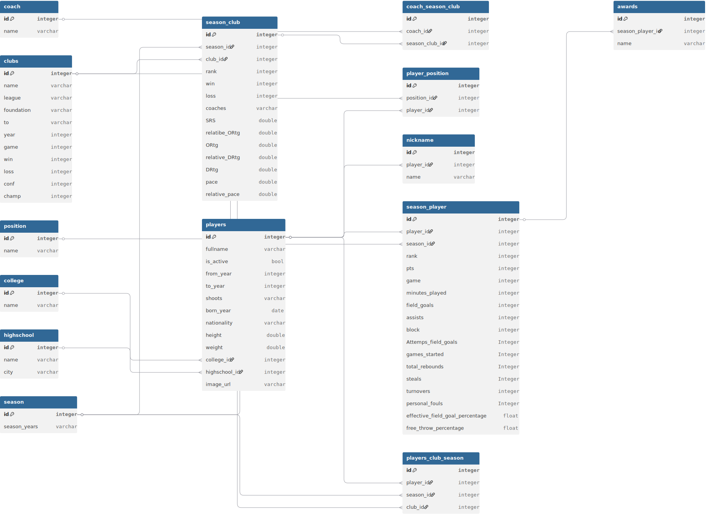

# Basketball Data Analysis Database Design

This phase of the project implements a **data pipeline** for cleaning, processing, and storing basketball statistical data. It is developed using **Python**, **Pandas**, and **SQLAlchemy ORM** to transform raw data into a standardized **Relational Database**.

---

# 1. Project Scope

Storing and processing the complete historical records of all players, leagues, and games from the beginning of basketball history would not only make the database structure overly complex and heavy, but would also introduce a large amount of obsolete data that is no longer aligned with modern basketball styles and trends.

For this reason, the project is limited according to the following strategies:

- **NBA-exclusive focus:** The dataset is specifically focused on the NBA, the world's most prestigious basketball league.
- **Limited time range (2017–2026):** Analyses are based on a modern nine-year period in which playing styles, tactics, and player statistics are recorded with the highest level of consistency and standardization.
- **Active player filter (`is_active = True`):** To reduce noise in the dataset, only seasonal information of players who were active during this period is extracted and processed.

---

# 2. Database Architecture Overview

The database has been designed in a fully normalized structure. The primary goals of normalization are to eliminate data redundancy, preserve data integrity, and establish logical relationships among different basketball entities.

Relationships in this database are divided into three main categories:

- **One-to-Many relationships:** For example, one player can have multiple nicknames, or one **College** can be associated with multiple players.
- **Many-to-Many relationships:** For example, the relationship between players and clubs across different seasons (a player may play for multiple clubs throughout different seasons, and a club has many players in each season).
- **Relational and Performance Tables:** Tables designed to store detailed player and team statistics separately for each season. These tables resolve many-to-many relationships into two or more one-to-many relationships.

---

# 3. Data Pipeline

| Stage | Technology | Description |
|-------|------------|-------------|
| Extraction | Pandas / Excel / CSV | Reading raw data |
| Transformation | Pandas | Standardizing formats, generating primary and foreign keys, assigning appropriate column names, removing invalid and empty columns, deleting empty rows, and creating separate tables for multi-valued columns |
| Loading | SQLAlchemy ORM | Converting cleaned records into database objects and inserting them into the database while maintaining foreign key relationships |

---

# 4. Project Setup

| Step | Command / Action | Description |
|------|------------------|-------------|
| 1. Clone Repository | `git clone <repository-url>` | Download a local copy of the project. |
| 2. Install Dependencies | `pip install -r requirements.txt` | Install all required dependencies. |
| 3. Environment Configuration | Configure the `.env` file | Enter the database connection information. First, create a database in your DBMS, then configure the `.env` file accordingly. |
| 4. Run Pipeline | `python main.py` | Execute the script to create the database tables and load the cleaned data. |

---

# 5. Database Structure and ERD

- The ERD diagram is included in the project as a separate file.

---

# 6. Core Database Entities

## 6.1 Players

This table is the core entity of the system and stores the personal, physical, and identity information of basketball players.

| Column Name | Description |
|-------------|-------------|
| id | Primary key and unique identifier of each player. |
| fullname | Player's full name. |
| is_active | Indicates whether the player is currently active. |
| from_year | Year the player began their professional career in the league. |
| to_year | Year the player ended their professional career in the league. |
| shoots | Player's shooting hand (Right or Left). |
| born_year | Player's birth year. |
| height | Player's height (in feet) for physical analysis. |
| weight | Player's weight (in pounds) for physical analysis. |
| college_id | Foreign key referencing the College table to track the player's academic background. |
| highschool_id | Foreign key referencing the Highschool table to track the player's educational background. |
| image_url | URL of the player's profile image for dashboards and user interfaces. |

---

## 6.2 Clubs

This table stores the structural information of basketball teams participating in the league.

| Column Name | Description |
|-------------|-------------|
| id | Primary key and unique identifier of the club. |
| name | Official name of the club. |
| league | Name of the league in which the club competes (NBA in this project). |
| foundation | Official year the club was founded. |
| to | Indicates the club's activity period or the latest recorded statistics. |
| year | Total number of seasons the club has participated in (used for calculation optimization). |
| game | Total number of games played by the club since its establishment. |
| win | Total number of wins in the club's history. |
| loss | Total number of losses in the club's history. |
| conf | Total number of conference championships (Eastern or Western Conference). |
| champ | Total number of league championships won by the club throughout its history. |

---

## 6.3 Season

A simple reference table that manages the time periods of basketball seasons.

| Column Name | Description |
|-------------|-------------|
| id | Primary key and unique identifier of each season. |
| season_years | Season label stored as a string (e.g., `2023-2024`). This project covers the seasons from **2017 to 2026**. |

---

## 6.4 Nickname

This table stores the nicknames of players. A player may have zero, one, or multiple nicknames.

| Column Name | Description |
|-------------|-------------|
| id | Primary key and unique identifier of the table. |
| player_id | Foreign key referencing the Players table. |
| name | Nickname or title by which the player is commonly known (e.g., **King James**). |

---

## 6.5 Position

This table stores the playing positions in basketball.

| Column Name | Description |
|-------------|-------------|
| id | Primary key and unique identifier of the table. |
| name | Name of the player's tactical position on the court. |

## 6.6 Player Position

Since a player may play in multiple positions, this table manages the **Many-to-Many** relationship between players and positions.

| Column Name | Description |
|-------------|-------------|
| id | Primary key and unique identifier of the table. |
| player_id | Foreign key referencing the Players table. |
| position_id | Foreign key referencing the Position table. |

---

## 6.7 Highschool

| Column Name | Description |
|-------------|-------------|
| id | Primary key and unique identifier of the table. |
| name | Name of the high school. |
| city | Name of the city where the high school is located. |

---

## 6.8 College

| Column Name | Description |
|-------------|-------------|
| id | Primary key and unique identifier of the table. |
| name | Name of the college. |

---

## 6.9 Coach

| Column Name | Description |
|-------------|-------------|
| id | Primary key and unique identifier of the table. |
| name | Full name of the head coach. |

---

## 6.10 Player Season Club

This table specifies which club a player belonged to during a particular season.

| Column Name | Description |
|-------------|-------------|
| id | Primary key and unique identifier of the table. |
| player_id | Foreign key referencing the Players table. |
| season_id | Foreign key referencing the Season table. |
| club_id | Foreign key referencing the Clubs table. |

---

## 6.11 Season Club

This table stores the seasonal performance of each club.

| Column Name | Description |
|-------------|-------------|
| id | Primary key and unique identifier of the table. |
| season_id | Foreign key referencing the Season table. |
| club_id | Foreign key referencing the Clubs table. |
| rank | Team ranking in the league standings for that season. |
| win | Number of games won by the team during the season. |
| loss | Number of games lost by the team during the season. |
| SRS | Simple Rating System (SRS), representing the team's overall strength based on strength of schedule and average point differential. |
| pace | Average number of possessions per 48 minutes, used to evaluate the team's playing pace. |
| relative_pace | Team pace relative to the league average. |
| ORtg | Offensive Rating, representing the number of points scored per 100 possessions. |
| relative_ORtg | Team Offensive Rating relative to the league average. |
| DRtg | Defensive Rating, representing the number of points allowed per 100 possessions. |
| relative_DRtg | Team Defensive Rating relative to the league average. |

---

## 6.12 Season Player

This table stores the seasonal performance statistics of each player.

| Column Name | Description |
|-------------|-------------|
| id | Primary key and unique identifier of the table. |
| player_id | Foreign key referencing the Players table. |
| season_id | Foreign key referencing the Season table. |
| rank | Player's statistical ranking for the season. |
| pts | Total points scored by the player. |
| game | Total number of games played during the season. |
| minutes_played | Total minutes played during the season. |
| field_goals | Total successful field goals made. |
| Attemps_field_goals | Total field goal attempts. |
| assists | Total assists recorded. |
| block | Total blocks recorded. |
| games_started | Number of games the player started as a member of the starting lineup. |
| total_rebounds | Total rebounds (offensive and defensive). |
| steals | Total steals recorded. |
| turnovers | Total turnovers committed. |
| personal_fouls | Total personal fouls committed. |
| effective_field_goal_percentage | Effective Field Goal Percentage (**eFG%**), which accounts for the higher value of three-point field goals. |
| free_throw_percentage | Free Throw Percentage (**FT%**). |

---

## 6.13 Awards

This table stores the awards earned by a player during a specific season.

| Column Name | Description |
|-------------|-------------|
| id | Primary key and unique identifier of the table. |
| season_player_id | Foreign key referencing the **Season Player** table to identify the season in which the award was received. |
| name | Name of the award or honor received by the player. |

**Note**

- The **Michael Jordan Trophy** is awarded to the league's **Most Valuable Player (MVP)** each season. At the end of every season, a list of the league's top players is published, and players receive rankings such as **MVP-1**, **MVP-2**, **MVP-3**, and so on, according to their final position in the MVP voting.

---

## 6.14 Coach Season Club

This table stores the head coaches of each team for every season. A team may have multiple head coaches during a single season.

| Column Name | Description |
|-------------|-------------|
| id | Primary key and unique identifier of the table. |
| coach_id | Foreign key referencing the Coach table. |
| club_season_id | Foreign key referencing the Season Club table. |
| wins | Number of games won by the coach with the team during that season. |
| losses | Number of games lost by the coach with the team during that season. |

---

